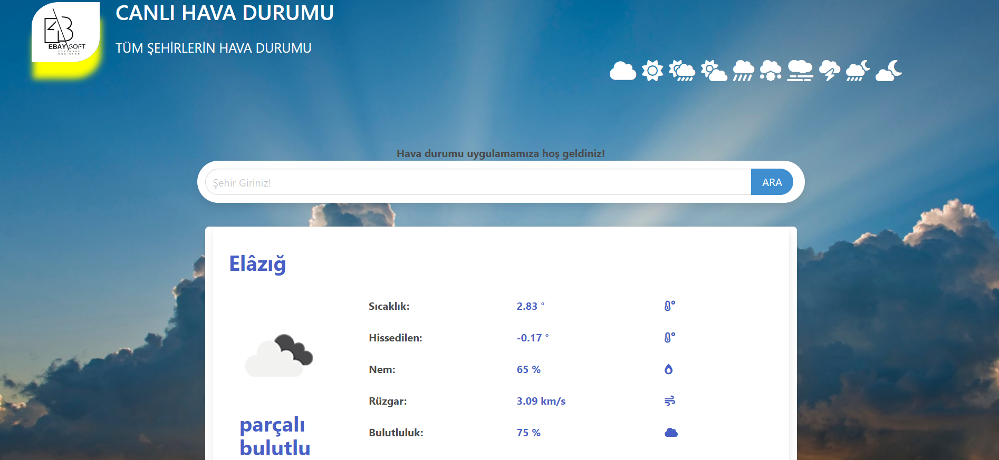
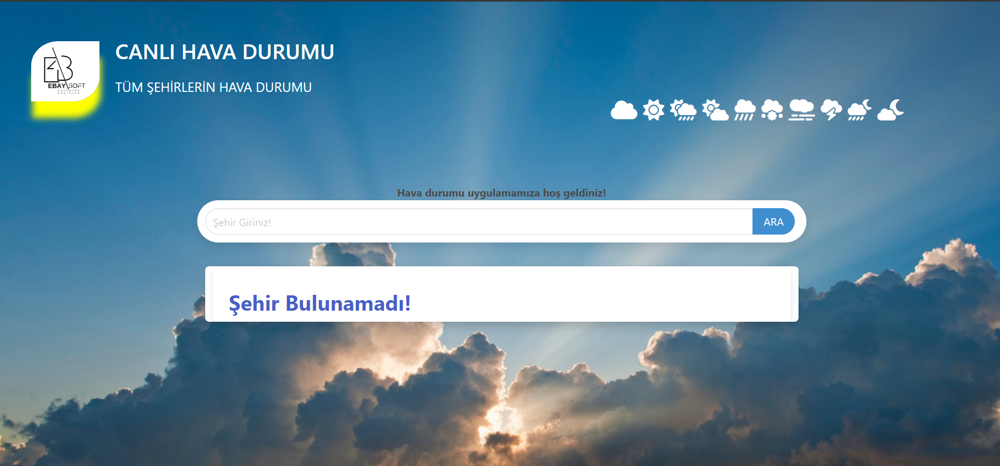

# ***HAVA DURUMA***

  

<b>-> Tüm dünya şehirlerinin hava durumu uygulaması</b>
  

-> Bu proje NODEJS ile yapılmıştır!

-> Uygulama ana sayfasına ilg girildiğinde kullanıcının ip adresi üzerinden konumuna ulaşıp konumunun hava durumunu verir ilk girişte
-> Ip sorgulaması aktif edilmesi için projenin sunucuya yüklenmesi gerekmektedir!

   

    

 
 

    

